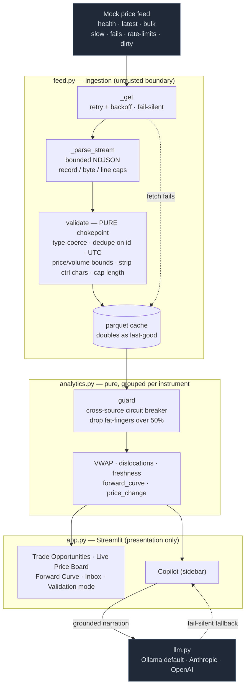
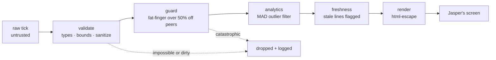
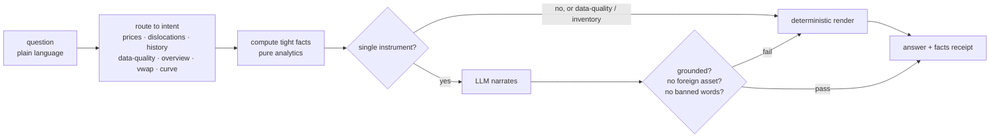

# Architecture — Magic Spyglass

Thin Streamlit presentation over a tested, pure engine. The feed is treated as untrusted; every
number passes a chain of trust gates before it can reach Jasper.

## 1. System data flow

## 2. Trust gates — what every number survives before display

Defense in depth: if one gate is bypassed, the next still holds.

## 3. Copilot answer pipeline — deterministic first, LLM second

Numbers are computed, then optionally narrated; the narration is number-grounded and word-banned, so
a decision never rests on a hallucination.

See `README.md` to run it, `PITCH.md` for the pitch/cut/truth, and `PHASES.md` for the build log.
